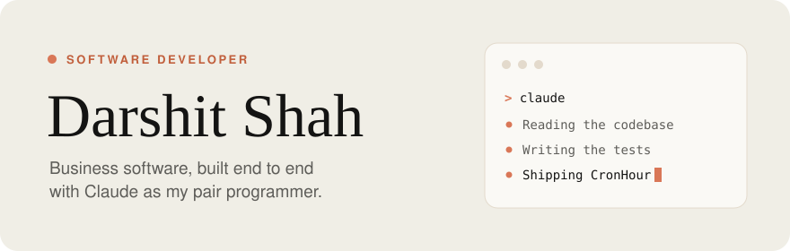

<picture>
  <source media="(prefers-color-scheme: dark)" srcset="./assets/header-dark.svg"/>
  
</picture>

  
  &nbsp;
  

 

## Featured work

### [CronHour](https://app.cronhour.com)

A work-management platform for small firms, replacing the mix of spreadsheets and chat groups they usually run on.

| | |
|---|---|
| **Work** | Projects, tasks, and custom workflows where each step can be held by several people |
| **Sales** | Leads, clients, quotations, invoices, payments and follow-ups |
| **People** | Attendance with face and PIN check-in, leave, payroll and salary slips |
| **Platform** | Roles with fine-grained permissions, per-organization subscriptions and plan limits |

`React` `TypeScript` `Tailwind CSS` `Fastify` `Prisma` `PostgreSQL` `Vitest` `Playwright`

&nbsp; 

 

  Designed in a warm, paper-like palette inspired by Claude. Thanks for reading.

